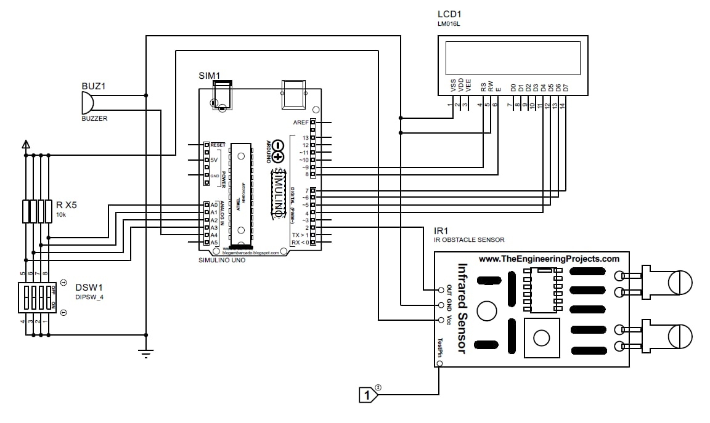
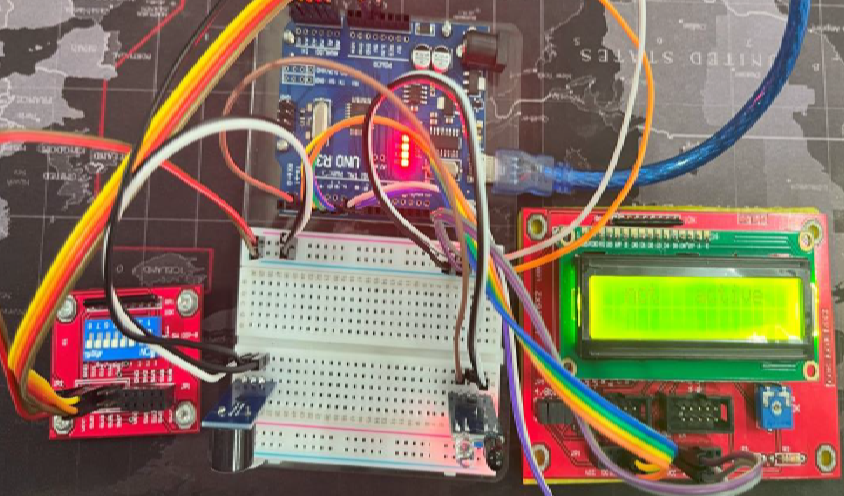

# 🔐 Anti-theft Sensor System (ATmega328P + Assembly)

This project is a low-level embedded system implementation of an **Anti-theft Sensor** using the **ATmega328P** microcontroller written in **Assembly language**. It detects unauthorized access and displays alert messages on an LCD while triggering a buzzer.

---

## 🎯 Project Objective

- Learn low-level programming using Assembly on ATmega328P
- Interface DIP switches and sensors with LCD
- Use external interrupt (INT0) for event-driven detection
- Display messages like `not active`, `Warning`, and `Found a thief!`

---

## 🧠 Technology & Tools

- ATmega328P Microcontroller
- Assembly Language
- AVR Assembler (e.g., Atmel Studio / MPLAB X with AVR plugin)
- LCD 16x2 display
- DIP Switch
- Buzzer or Alarm

---

## 📂 File Structure

```
Anti-theft-sensor/
├── Anti-theft-sensor.asm      # Main assembly code
├── README.md                  # Project documentation
```

---

## 🚀 How It Works

- The system checks DIP switch status via PORTC.
- If switch is in "active" mode, it listens for sensor input via INT0.
- When triggered:
  - If not active, LCD shows `not active`
  - If mode 0x03: LCD shows `Warning!`
  - If mode 0x0C: LCD shows `Found a thief!`
- The messages stay for a delay before resetting.

---

## ⚙️ How to Run

1. Write the code to your ATmega328P board using an AVR programmer.
2. Connect:
   - Sensor to PD2 (INT0)
   - LCD to PORTD
   - Control lines (RS, EN) to PORTB0, PORTB1
   - DIP Switch to PC0–PC3
3. Set DIP Switch accordingly and trigger the sensor.

---

## 📸 Screenshots




---

## 🎥 Demonstration Video

📽️ [Click to watch the video](image/Untitled%20video%20-%20Made%20with%20Clipchamp.mp4)

---

## 🙌 Author

Developed by [PhoorinNickphong](https://github.com/PhoorinNickphong)
